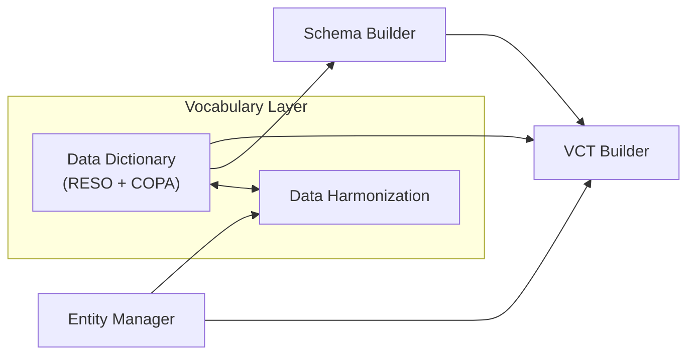

# COPA Apps

## Overview

| App | Purpose | Inputs | Outputs (to VDR) |
|-----|---------|--------|------------------|
| **Data Dictionary** | Manage RESO + COPA vocabulary | RESO definitions, domain knowledge | `credentials/contexts/copa-vocab.jsonld` |
| **Data Harmonization** | Map furnisher fields to vocab | Entities (data sources), Vocab (terms) | `credentials/harmonization/mappings.json` |
| **Entity Manager** | Onboard ecosystem entities | Entity information, data source specs | `credentials/entities/*.json` |
| **Schema Builder** | Define credential structure | Vocab terms from Data Dictionary | `credentials/schemas/*.json` |
| **VCT Builder** | Credential branding & claim binding | Schema (properties), Vocab (terms), Entities | `credentials/vct/*.json` |

---

## App Dependencies

---

## App Details

### Data Dictionary

The Data Dictionary manages the canonical vocabulary for the ecosystem:

- **RESO Base**: Industry-standard property and real estate terms
- **COPA Extensions**: Custom terms for identity, financial, and badge credentials
- **Output**: JSON-LD context file with semantic definitions

### Data Harmonization

Maps raw data from furnishers to canonical vocabulary terms:

- **Input**: Entity data sources (from Entity Manager), Vocab terms (from Data Dictionary)
- **Output**: Mapping file linking furnisher fields to RESO/COPA terms
- **Purpose**: Enables multiple furnishers to provide semantically equivalent data

### Entity Manager

Onboards and manages ecosystem participants:

- **Entity Types**: Data furnishers, issuers, verifiers
- **Data Sources**: API definitions, field specifications
- **Logos**: Visual branding for credential display

### Schema Builder

Defines the structure of credentials:

- **Input**: Vocabulary terms from Data Dictionary
- **Output**: JSON Schema files for credential validation
- **Focus**: `credentialSubject` structure only (JWT wrapper is spec-defined)

### VCT Builder

Creates the complete credential type definition:

- **Combines**: Schema (validation), Vocabulary (semantics), Entity (branding)
- **Defines**: Display properties, claim bindings, evidence requirements
- **Output**: The primary artifact fetched by issuance services
