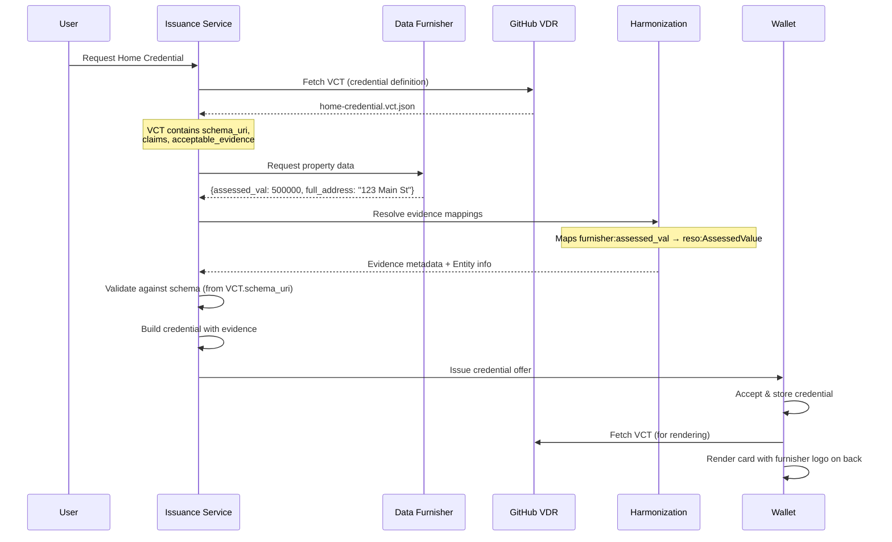

# Data Flow

## Credential Issuance



---

## Evidence in Credentials

When a credential is issued, evidence fields capture the data source:

```json
{
  "@context": ["https://www.w3.org/ns/credentials/v2"],
  "type": ["VerifiableCredential", "HomeCredential"],
  "credentialSubject": {
    "AssessedValue": 500000,
    "UnparsedAddress": "123 Main St, Vancouver, BC"
  },
  "evidence": [
    {
      "type": "DataSourceEvidence",
      "verifier": "https://openpropertyassociation.ca",
      "sourceEntity": "https://openpropertyassociation.ca/credentials/entities/furnisher-example.json",
      "sourceName": "Example Data Furnisher",
      "verificationDate": "2024-12-11T10:30:00Z",
      "claimsCovered": ["AssessedValue", "UnparsedAddress"]
    }
  ]
}
```

The wallet uses this evidence to:

1. Display the furnisher logo on the credential back
2. Show verification provenance to relying parties

---

## Multiple Evidence Sources

A single credential may combine data from multiple furnishers:

```json
"evidence": [
  {
    "type": "DataSourceEvidence",
    "sourceEntity": "furnisher-a",
    "claimsCovered": ["givenName", "familyName"]
  },
  {
    "type": "DataSourceEvidence",
    "sourceEntity": "furnisher-b",
    "claimsCovered": ["AssessedValue", "UnparsedAddress"]
  }
]
```

The wallet would display logos from both furnishers on the credential back.

---

## Future Considerations

### Trust Registry Integration

Before accepting data from furnishers in an open ecosystem:

- Verify the furnisher is authorized in the trust registry
- Query trust registry to validate entity status
- Prevent spoofing attacks

This is not needed now (closed ecosystem) but the architecture supports it.
