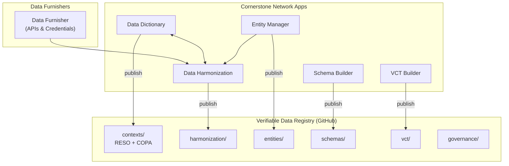
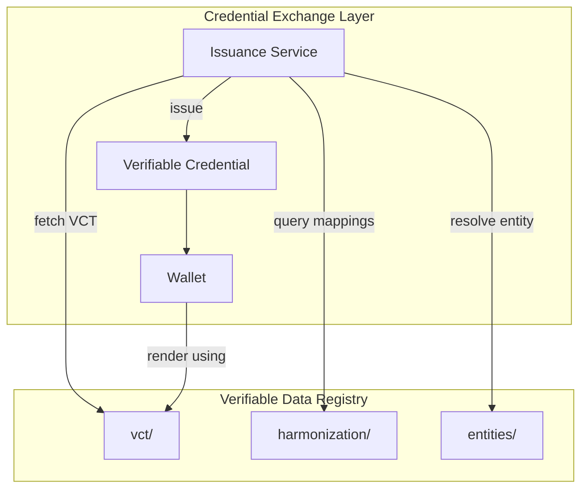

# Solution Architecture

## Executive Summary

This document describes the architecture of the Canadian Open Property Association (COPA) credential ecosystem. The system enables the issuance of verifiable credentials backed by authoritative data sources, with full traceability from raw data to issued credentials.

**Key Insight**: Everything within the governance boundary is managed through Cornerstone Network Apps and published to GitHub (our Verifiable Data Registry). The credential exchange layer sits outside this boundary but relies on VDR artifacts for credential offers and rendering.

---

## Architecture Overview

### Governance Layer

Cornerstone Network Apps define vocabulary, schemas, entities, and mappings - all published to the Verifiable Data Registry (GitHub).

### Credential Exchange Layer

The exchange layer sits **below** the governance boundary - it consumes VDR artifacts to issue and render credentials.

---

## The Governance Boundary

Everything **inside** the governance boundary is:

- Defined through Cornerstone Network Apps
- Published to the GitHub VDR
- Versioned and auditable
- Resolvable via stable URLs

Everything **outside** the governance boundary is:

- The actual credential exchange (issuance, presentation, verification)
- Relies on VDR artifacts (VCT, Schema, Harmonization)
- Stores references to VDR artifacts in issued credentials

---

## Summary

The COPA credential ecosystem separates:

1. **Governance** (Cornerstone Network Apps + GitHub VDR) - Defines vocabulary (RESO + extensions), schemas, VCTs, entities, and harmonization mappings
2. **Exchange** (Issuance services + Wallets) - Fetches VCTs for credential offers, issues credentials, renders in wallets

This separation provides:

- **Traceability**: Every credential claim traces back to a canonical vocab term and data source
- **Standards-based**: RESO vocabulary provides industry-standard terminology
- **Flexibility**: Multiple data sources can provide the same semantic data
- **Trust**: Evidence fields enable verification of data provenance
- **Interoperability**: Standard formats (JSON Schema, JSON-LD, VCT) enable ecosystem growth
